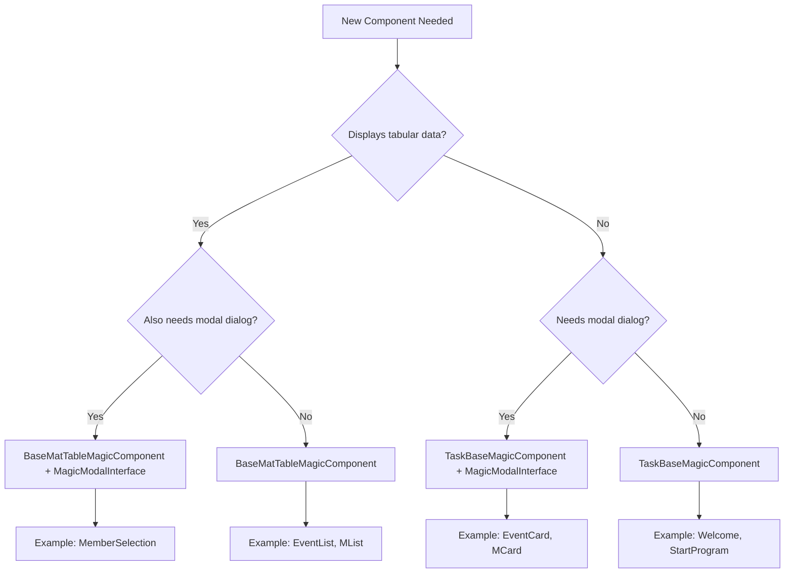

# 📚 docs: Create comprehensive design guidelines for Angular components in Magic XPA hybrid architecture

## Overview

Establish comprehensive design guidelines for developing Angular 19 components within the UiExpert hybrid architecture (Magic XPA + Angular). Currently, the project lacks formal documentation beyond basic project setup, leading to inconsistencies in component design, styling approaches, and metadata structuring. This initiative will create a complete design system documentation suite covering metadata design, component patterns, styling standards, accessibility requirements, and testing strategies.

**Impact:** Improves developer onboarding, ensures UI/UX consistency, reduces technical debt, and prepares the codebase for European Accessibility Act (EAA) compliance deadline of June 28, 2025.

## Problem Statement

### Current State

The UiExpert project successfully implements a hybrid Magic XPA + Angular 19 architecture with 10 auto-generated components across 3 domains (Events, Members, mainWC). However:

1. **No formal design documentation exists** beyond `CLAUDE.md` (which covers architecture but not design patterns)
2. **Inconsistent patterns across components**:
   - Error positioning varies (`<mgError>` inside vs outside `<mat-form-field>`)
   - Button visibility uses both `[disabled]` and `[style.visibility]`
   - Wrapper div usage is inconsistent
   - Mixed naming conventions (underscores vs camelCase)
3. **Sparse CSS utilization**: `magic-styles.css` defines 20+ classes but only 3 are actively used
4. **No testing examples** for auto-generated components
5. **Accessibility gaps**: No ARIA guidance, approaching EAA compliance deadline
6. **Knowledge silos**: Critical constraint (don't edit `.g.ts` files) not formally documented

### Why This Matters

**For Developers:**
- Reduces onboarding time for new team members
- Provides clear decision-making frameworks (when to use TaskBaseMagicComponent vs BaseMatTableMagicComponent)
- Prevents costly mistakes (editing generated files)

**For Users:**
- Consistent UI/UX across the application
- Improved accessibility compliance
- Better performance through standardized patterns

**For the Project:**
- Reduces technical debt from pattern inconsistencies
- Facilitates scaling to additional components
- Ensures maintainability as team grows

## Proposed Solution

Create a comprehensive design guidelines documentation suite consisting of:

1. **METADATA_DESIGN_GUIDE.md** - Magic XPA metadata structuring best practices
2. **COMPONENT_PATTERNS_GUIDE.md** - Component type decision matrix and usage patterns
3. **STYLING_GUIDE.md** - CSS, theming, and Material Design standards
4. **ACCESSIBILITY_GUIDE.md** - WCAG 2.2 compliance and ARIA implementation
5. **TESTING_GUIDE.md** - Testing strategies for generated components
6. **Update CLAUDE.md** - Add cross-references to new documentation

## Technical Approach

### Architecture Context

**Critical Understanding:** In this hybrid architecture, there are three layers:

```
┌─────────────────────────────────────────────┐
│  Magic XPA Backend (Source/*.xml)          │
│  Backend logic, data models, programs      │
└─────────────────┬───────────────────────────┘
                  │
                  ▼
┌─────────────────────────────────────────────┐
│  Metadata Layer (magic-metadata/*.json)    │ ◄── EDITABLE (Design Guidelines Target)
│  UI definitions, form structure, controls  │
└─────────────────┬───────────────────────────┘
                  │ Magic CLI Generation
                  ▼
┌─────────────────────────────────────────────┐
│  Angular Components (src/app/magic/*.ts)   │ ◄── READ-ONLY (Auto-generated)
│  TypeScript components, HTML templates     │
└─────────────────────────────────────────────┘
```

**Key Insight:** Design guidelines must target the **metadata layer**, not the generated Angular code. Any manual edits to generated files (`.g.ts`, component `.ts`/`.html`) are lost on regeneration.

### Implementation Phases

#### Phase 1: Foundation Documentation (Week 1-2)

**Tasks:**
- [ ] Create `docs/` directory structure
- [ ] Write METADATA_DESIGN_GUIDE.md covering JSON metadata best practices
- [ ] Document controlType codes and their Angular equivalents
- [ ] Establish coordinate system conventions for responsive design
- [ ] Create metadata examples for common UI patterns

**Deliverables:**
- `docs/design-guidelines/METADATA_DESIGN_GUIDE.md`
- Example metadata files in `docs/examples/metadata/`

**Success Criteria:**
- Developers can structure new Magic XPA forms following documented patterns
- Metadata validation checklist created
- At least 5 real-world examples documented

**File Examples:**

`docs/examples/metadata/basic-form.json`:
```json
{
  "style": null,
  "props": {
    "id": "ExampleForm",
    "window_type": 12,
    "component_path": "Examples/ExampleForm/",
    "component_uniquename": "ExampleForm_ExampleForm"
  },
  "coordinates": {"x": 0, "y": 0, "width": 600, "height": 400},
  "children": [
    {
      "props": {"id": "FormField_Name", "controlType": "E"},
      "coordinates": {"x": 10, "y": 10, "width": 200, "height": 30}
    }
  ]
}
```

#### Phase 2: Component Patterns (Week 2-3)

**Tasks:**
- [ ] Create COMPONENT_PATTERNS_GUIDE.md with component type taxonomy
- [ ] Document when to use TaskBaseMagicComponent vs BaseMatTableMagicComponent
- [ ] Provide decision flowchart for MagicModalInterface implementation
- [ ] Catalog all 10 existing components as pattern references
- [ ] Document safe customization zones (override methods)
- [ ] Create wrapper component examples for extending generated code

**Deliverables:**
- `docs/design-guidelines/COMPONENT_PATTERNS_GUIDE.md`
- Component type decision flowchart (Mermaid diagram)
- Example wrapper components in `docs/examples/components/`

**Success Criteria:**
- Clear decision matrix for component base class selection
- All override methods documented with examples
- Nested component patterns (like UserDropdown) explained

**Component Type Decision Matrix:**



#### Phase 3: Styling & Theming (Week 3-4)

**Tasks:**
- [ ] Create STYLING_GUIDE.md with CSS organization standards
- [ ] Audit magic-styles.css and remove unused classes
- [ ] Document when to use inline styles vs CSS classes
- [ ] Establish Material Design theme customization process
- [ ] Create responsive design patterns for metadata coordinates
- [ ] Define CSS class naming conventions
- [ ] Document flexbox layout conventions

**Deliverables:**
- `docs/design-guidelines/STYLING_GUIDE.md`
- Cleaned `src/magic-styles.css` with documented classes
- Custom Material theme configuration example

**Success Criteria:**
- All CSS classes in magic-styles.css are documented and used
- Clear inline style vs CSS class decision guidelines
- Material theme tokens documented
- Responsive breakpoint strategy established

**Styling Decision Tree:**

```markdown
## When to Use Inline Styles vs CSS Classes

### Use Inline Styles For:
✅ Layout structure (flexbox: `display: flex; flex-direction: row/column`)
✅ Component-specific dimensions from metadata coordinates
✅ Dynamic visibility (`[style.visibility]="mg.getVisible(mgc.Control)"`)

### Use CSS Classes For:
✅ Reusable visual styles (borders, shadows, colors)
✅ Hover/focus/active states
✅ Theme-dependent styles
✅ Responsive design breakpoints

### Example:
```html
<!-- Layout: inline styles -->
<div style="display: flex; flex-direction: row">
  <!-- Visual style: CSS class -->
  <mat-card class="container_border">
    <input [style.visibility]="mg.getVisible(mgc.Field)">
  </mat-card>
</div>
```
```

#### Phase 4: Accessibility & Compliance (Week 4-5)

**Tasks:**
- [ ] Create ACCESSIBILITY_GUIDE.md with WCAG 2.2 requirements
- [ ] Document ARIA attribute patterns for Magic components
- [ ] Establish keyboard navigation standards
- [ ] Create screen reader testing checklist
- [ ] Document color contrast requirements (Material theme)
- [ ] Provide form label and error announcement patterns
- [ ] Create accessibility testing workflow

**Deliverables:**
- `docs/design-guidelines/ACCESSIBILITY_GUIDE.md`
- ARIA attribute templates for common patterns
- Accessibility testing checklist

**Success Criteria:**
- All WCAG 2.2 Level AA requirements documented
- ARIA patterns for forms, tables, modals, buttons
- Keyboard navigation map for each component type
- Compliance roadmap for June 28, 2025 EAA deadline

**Critical Deadline:** European Accessibility Act (EAA) compliance required by **June 28, 2025**

**ARIA Pattern Example:**

```html
<!-- Form Field with ARIA -->
<mat-form-field>
  <mat-label id="event-name-label">Event Name</mat-label>
  <input
    matInput
    [magic]="mgc.Event_Name"
    [formControlName]="mgc.Event_Name"
    aria-labelledby="event-name-label"
    aria-required="true"
    [attr.aria-invalid]="mgfc.Event_Name.invalid && mgfc.Event_Name.touched"
    [attr.aria-describedby]="mgfc.Event_Name.invalid ? 'event-name-error' : null"
  >
  <mgError [magic]="mgc.Event_Name" id="event-name-error" role="alert"></mgError>
</mat-form-field>
```

#### Phase 5: Testing Strategy (Week 5-6)

**Tasks:**
- [ ] Create TESTING_GUIDE.md for generated components
- [ ] Document Magic service mocking strategies
- [ ] Provide unit test examples for each component type
- [ ] Create integration test patterns
- [ ] Document test coverage requirements
- [ ] Establish CI/CD testing workflow

**Deliverables:**
- `docs/design-guidelines/TESTING_GUIDE.md`
- Test file templates in `docs/examples/tests/`
- Magic service mock utilities

**Success Criteria:**
- Mock implementations for `mg`, `task`, `tableService`, `mgSub`
- Test examples for forms, tables, modals
- Code coverage target established (recommend 80%+)

**Testing Example:**

`docs/examples/tests/event-card.component.spec.ts`:
```typescript
import { ComponentFixture, TestBed } from '@angular/core/testing';
import { EventCard } from './EventCard.component';
import { magicProviders } from '@magic-xpa/angular';
import { MagicServices } from '@magic-xpa/angular';

describe('EventCard Component', () => {
  let component: EventCard;
  let fixture: ComponentFixture<EventCard>;
  let magicServices: jasmine.SpyObj<MagicServices>;

  beforeEach(async () => {
    const magicServicesSpy = jasmine.createSpyObj('MagicServices', [
      'getValue',
      'getVisible',
      'isDisabled'
    ]);

    await TestBed.configureTestingModule({
      declarations: [EventCard],
      providers: [
        ...magicProviders,
        { provide: MagicServices, useValue: magicServicesSpy }
      ]
    }).compileComponents();

    fixture = TestBed.createComponent(EventCard);
    component = fixture.componentInstance;
    magicServices = TestBed.inject(MagicServices) as jasmine.SpyObj<MagicServices>;
  });

  it('should create modal with correct configuration', () => {
    expect(component.Width()).toBe('300px');
    expect(component.IsCenteredToWindow()).toBe(true);
  });

  it('should display event ID when value is set', () => {
    magicServices.getValue.and.returnValue('12345');
    fixture.detectChanges();
    const compiled = fixture.nativeElement;
    // Add assertions for rendered value
  });
});
```

#### Phase 6: Documentation Integration (Week 6)

**Tasks:**
- [ ] Update CLAUDE.md with links to new documentation
- [ ] Create master DESIGN_GUIDELINES.md index
- [ ] Add navigation between documentation files
- [ ] Create quick reference cheat sheets
- [ ] Add Mermaid diagrams for workflows
- [ ] Set up documentation review process

**Deliverables:**
- Updated `CLAUDE.md` with design guidelines section
- `docs/design-guidelines/README.md` (master index)
- Quick reference cards in `docs/quick-reference/`

**Success Criteria:**
- All documentation cross-linked
- Searchable index created
- Developer onboarding checklist includes documentation review

## Alternative Approaches Considered

### Option A: Single Monolithic Guide (Rejected)
**Pros:** All info in one place
**Cons:** Too large (200+ pages estimated), difficult to navigate, hard to maintain
**Decision:** Rejected in favor of modular approach

### Option B: Wiki-based Documentation (Rejected)
**Pros:** Easy collaboration, version history
**Cons:** Separate from codebase, can become outdated, not in version control
**Decision:** Rejected - prefer Markdown in repo for version control

### Option C: Code Comments Only (Rejected)
**Pros:** Documentation lives with code
**Cons:** Doesn't work for generated code (comments lost on regeneration), no high-level guidance
**Decision:** Rejected - need separate design documentation

### Option D: Modular Markdown Documentation Suite (Selected)
**Pros:** Organized by concern, version controlled, easily searchable, maintainable
**Cons:** Requires discipline to keep updated
**Decision:** Selected - best balance of organization and maintainability

## Acceptance Criteria

### Functional Requirements

- [ ] **METADATA_DESIGN_GUIDE.md exists** with:
  - [ ] All controlType codes documented
  - [ ] Coordinate system best practices
  - [ ] At least 5 real-world metadata examples
  - [ ] Validation checklist

- [ ] **COMPONENT_PATTERNS_GUIDE.md exists** with:
  - [ ] Component type decision flowchart (Mermaid)
  - [ ] All 10 existing components cataloged as examples
  - [ ] Safe customization zones documented
  - [ ] Override method reference (mgOnLoad, PropertyChanged, RecordsCountChanged)
  - [ ] Wrapper component pattern examples

- [ ] **STYLING_GUIDE.md exists** with:
  - [ ] Inline style vs CSS class decision matrix
  - [ ] Cleaned magic-styles.css (unused classes removed)
  - [ ] Material theme customization guide
  - [ ] Responsive design patterns
  - [ ] CSS naming conventions

- [ ] **ACCESSIBILITY_GUIDE.md exists** with:
  - [ ] WCAG 2.2 Level AA requirements
  - [ ] ARIA patterns for forms, tables, modals, buttons
  - [ ] Keyboard navigation maps
  - [ ] Screen reader testing checklist
  - [ ] EAA compliance roadmap

- [ ] **TESTING_GUIDE.md exists** with:
  - [ ] Magic service mocking examples
  - [ ] Test templates for all component types
  - [ ] Code coverage configuration
  - [ ] CI/CD integration guidance

### Non-Functional Requirements

- [ ] **Performance**: Documentation loads quickly (all files < 500KB)
- [ ] **Searchability**: All guides have table of contents with anchor links
- [ ] **Maintainability**: Each guide has "Last Updated" date and changelog section
- [ ] **Accessibility**: Documentation itself is accessible (proper headings, alt text for diagrams)
- [ ] **Completeness**: No "TODO" sections in published documentation

### Quality Gates

- [ ] **Peer Review**: At least 2 team members review each guide
- [ ] **Technical Accuracy**: All code examples tested in actual project
- [ ] **Consistency**: Terminology consistent across all documents
- [ ] **Navigation**: All guides cross-linked where relevant
- [ ] **Examples**: Every guideline has at least one code example

## Success Metrics

### Quantitative Metrics

1. **Developer Onboarding Time**
   - **Baseline**: 5-7 days for new developer to be productive
   - **Target**: 2-3 days with comprehensive documentation
   - **Measurement**: Time to first meaningful commit

2. **Code Review Velocity**
   - **Baseline**: 15-20 design-related comments per PR
   - **Target**: 5-10 comments per PR (reduced by 50-66%)
   - **Measurement**: GitHub PR review comment count

3. **Documentation Usage**
   - **Target**: 80% of team has read all core guides within 1 month
   - **Measurement**: Internal survey

4. **Pattern Consistency**
   - **Baseline**: 30% of components follow inconsistent patterns
   - **Target**: <10% inconsistency in new components
   - **Measurement**: Code audit of components created post-documentation

### Qualitative Metrics

1. **Developer Confidence**
   - Survey question: "I feel confident making component design decisions" (1-5 scale)
   - **Target**: Average 4.0+ rating

2. **Onboarding Experience**
   - New developer feedback on documentation clarity
   - **Target**: 90% positive feedback

3. **Accessibility Awareness**
   - Survey question: "I understand WCAG 2.2 requirements for our project" (1-5 scale)
   - **Target**: Average 4.0+ rating

## Dependencies & Prerequisites

### Internal Dependencies

- [ ] **Access to Magic XPA Studio** - To validate metadata examples
- [ ] **Working local development environment** - To test code examples
- [ ] **Git repository write access** - To commit documentation

### External Dependencies

- [ ] **Angular 19 documentation** - Reference for component patterns
- [ ] **Magic XPA documentation** - Reference for metadata structure
- [ ] **WCAG 2.2 guidelines** - Reference for accessibility standards

### Blockers

⚠️ **None identified** - This is a documentation-only initiative

## Risk Analysis & Mitigation

### Risk 1: Documentation Becomes Outdated
**Likelihood:** High
**Impact:** Medium
**Mitigation:**
- Add "Last Updated" dates to all documents
- Include documentation review in PR checklist
- Assign documentation owner for each guide
- Quarterly documentation audit

### Risk 2: Too Prescriptive, Stifles Creativity
**Likelihood:** Medium
**Impact:** Low
**Mitigation:**
- Frame as "guidelines" not "rules"
- Include section on "When to Deviate" in each guide
- Encourage team to propose guideline updates
- Biannual guideline review meetings

### Risk 3: Low Adoption by Team
**Likelihood:** Medium
**Impact:** High
**Mitigation:**
- Involve team in creating guidelines
- Present guidelines in team meeting
- Add to onboarding checklist
- Reference in code reviews
- Make guidelines searchable and easy to navigate

### Risk 4: Incomplete Coverage (Missing Edge Cases)
**Likelihood:** High
**Impact:** Low
**Mitigation:**
- Iterate on documentation based on team questions
- Add FAQ section to each guide
- Maintain "Known Gaps" section
- Encourage team to contribute examples

### Risk 5: Magic XPA Upgrade Changes Patterns
**Likelihood:** Medium
**Impact:** High
**Mitigation:**
- Version guidelines with Magic XPA version
- Test documentation against new Magic versions
- Maintain migration guides for major version changes

## Resource Requirements

### Team Resources

**Primary Author** (60-80 hours total):
- Week 1-2: Metadata guide (12-16 hours)
- Week 2-3: Component patterns guide (12-16 hours)
- Week 3-4: Styling guide (12-16 hours)
- Week 4-5: Accessibility guide (12-16 hours)
- Week 5-6: Testing guide (8-12 hours)
- Week 6: Integration and review (4-8 hours)

**Peer Reviewers** (20-30 hours total):
- 2 reviewers × 2-3 hours per guide

**Technical SME** (10-15 hours):
- Magic XPA expert consultation
- Validation of metadata examples

### Infrastructure

- ✅ Git repository (existing)
- ✅ Markdown rendering (GitHub)
- ✅ Mermaid diagram support (GitHub)
- 🆕 Documentation site (optional, future enhancement)

### Tools

- Text editor (VS Code recommended)
- Mermaid Live Editor for diagrams
- GitHub for version control and PR reviews
- Magic XPA Studio for metadata validation

## Future Considerations

### Phase 2 Enhancements (Post-Initial Release)

1. **Interactive Documentation Site**
   - Deploy docs using VuePress, Docusaurus, or similar
   - Add search functionality
   - Include interactive code playgrounds

2. **Video Tutorials**
   - Screen recordings for common workflows
   - "How to design a form in Magic XPA" walkthrough
   - "Extending generated components safely" tutorial

3. **CLI Tools**
   - Metadata validator CLI tool
   - Component scaffold generator
   - Accessibility checker automation

4. **Design System Components**
   - Reusable Magic metadata templates
   - Component library for common patterns
   - Figma/Sketch design files

### Extensibility

Documentation structure designed to accommodate:
- Additional component types (charts, maps, etc.)
- New Magic XPA features
- Angular version upgrades
- Third-party library integrations

### Long-term Vision

Transform UiExpert into a reference implementation for Magic XPA + Angular hybrid applications, with documentation that can be:
- Open-sourced as community resource
- Adapted for other Magic XPA projects
- Used in Magic XPA training materials

## Documentation Plan

### Files to Create

```
docs/
├── design-guidelines/
│   ├── README.md (Master index with navigation)
│   ├── METADATA_DESIGN_GUIDE.md
│   ├── COMPONENT_PATTERNS_GUIDE.md
│   ├── STYLING_GUIDE.md
│   ├── ACCESSIBILITY_GUIDE.md
│   └── TESTING_GUIDE.md
├── examples/
│   ├── metadata/
│   │   ├── basic-form.json
│   │   ├── table-with-modal.json
│   │   └── nested-subform.json
│   ├── components/
│   │   ├── wrapper-component-example.ts
│   │   └── custom-validation-example.ts
│   └── tests/
│       ├── form-component.spec.ts
│       └── table-component.spec.ts
└── quick-reference/
    ├── component-decision-matrix.md
    ├── aria-patterns-cheatsheet.md
    └── magic-services-api.md
```

### Files to Update

```
CLAUDE.md (Add design guidelines section at line 138+)
Angular/UiExpert/src/magic-styles.css (Clean up and document)
Angular/UiExpert/README.md (Add link to design guidelines)
```

## References & Research

### Internal References

**Repository Structure Analysis:**
- Component inventory: `Angular/UiExpert/src/app/magic/` (10 components across 3 domains)
- Configuration files: `Angular/UiExpert/angular.json:8-17` (standalone: false)
- Styling files: `Angular/UiExpert/src/magic-styles.css:1-132` (20+ classes, 3 actively used)
- Magic module: `Angular/UiExpert/src/app/magic/magic.gen.lib.module.ts:1-97`

**Component Pattern Examples:**
- Form modal: `Angular/UiExpert/src/app/magic/Events/EventCard/EventCard.component.ts:18-65`
- Table component: `Angular/UiExpert/src/app/magic/Events/EventList/EventList.component.ts:17-27`
- Hybrid table/modal: `Angular/UiExpert/src/app/magic/Events/MemberSelection/MemberSelection.component.ts:19`
- Generated controls: `Angular/UiExpert/src/app/magic/Events/EventCard/EventCard.mg.controls.g.ts:8-76`

**Template Patterns:**
- Form field pattern: `Angular/UiExpert/src/app/magic/Events/EventCard/EventCard.component.html:47-61`
- Table structure: `Angular/UiExpert/src/app/magic/Events/EventList/EventList.component.html:16-396`
- Dropdown pattern: `Angular/UiExpert/src/app/magic/Events/EventCard/EventCard.component.html:28-46`

**Metadata Structure:**
- JSON format: `Angular/UiExpert/magic-metadata/Events/EventCard/EventCard.json`
- Generation config: `Angular/UiExpert/magic-metadata/config.json:1-31`
- Server config: `Angular/UiExpert/magic-metadata/server-config.json`

**Current Documentation:**
- Project overview: `CLAUDE.md:1-138`
- Angular README: `Angular/UiExpert/README.md:1-60`

### External References

**Angular 19 Best Practices:**
- Official Angular Style Guide: https://angular.dev/style-guide
- Component Architecture Patterns: https://angular-university.io/lesson/angular-architecture-smart-vs-presentation-components
- Angular Material Theming: https://material.angular.io/guide/theming
- Performance Optimization: https://web.dev/articles/angular-signals (50-60% rendering improvement with OnPush)
- Signals Documentation: https://angular.dev/guide/signals (stable in Angular 19)

**Accessibility Standards:**
- WCAG 2.2 Guidelines: https://www.w3.org/WAI/WCAG22/quickref/
- European Accessibility Act: https://ec.europa.eu/social/main.jsp?catId=1202 (Deadline: June 28, 2025)
- Angular CDK Accessibility: https://material.angular.io/cdk/a11y/overview
- ARIA Authoring Practices: https://www.w3.org/WAI/ARIA/apg/

**Magic XPA Integration:**
- Magic XPA Angular Package: `node_modules/@magic-xpa/angular/` (v4.1200.0)
- TaskBaseMagicComponent: `node_modules/@magic-xpa/angular/src/ui/task-base.magic.component.d.ts`
- Magic Providers: `node_modules/@magic-xpa/angular/src/services/magic.providers.d.ts`

**Testing Resources:**
- Angular Testing Guide: https://angular.dev/guide/testing
- Jasmine Documentation: https://jasmine.github.io/
- Testing Best Practices: https://testing-angular.com/

### Related Work

**Similar Documentation Initiatives:**
- Angular Material Design System: https://material.angular.io/
- Clarity Design System: https://clarity.design/
- Carbon Design System: https://www.carbondesignsystem.com/

**Industry Best Practices:**
- Google TypeScript Style Guide: https://google.github.io/styleguide/tsguide.html
- Airbnb JavaScript Style Guide: https://github.com/airbnb/javascript
- Microsoft Accessibility Guidelines: https://www.microsoft.com/en-us/accessibility

---

🤖 Generated with [Claude Code](https://claude.com/claude-code)

Co-Authored-By: Claude <noreply@anthropic.com>
